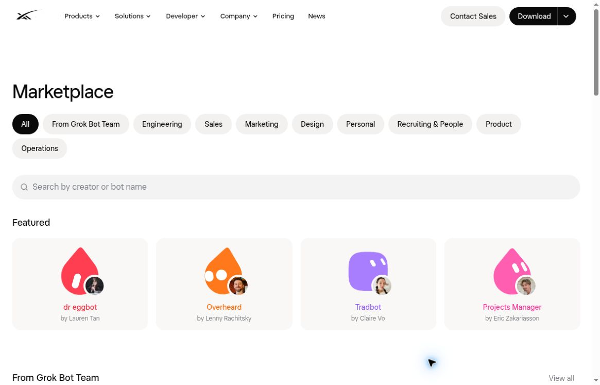

# Competitor comparison

確認日：2026-10-04。初回ドラフト。出典・バージョンは各製品ノートを参照。未確認は欠点や非対応ではありません。

## Interaction model

**原作の概念図。実際の製品UIではありません。** 公式説明で現れる入口と作業の置き場所を抽象化しています。図は3製品の抽象化です。Dotの確認事項は表に追加し、Instinctは対象同定を待ちます。

| Product / evidence | 入口 | 継続する作業の置き場所 |
| --- | --- | --- |
| [Muse](competitors/muse.md) / announced | Main chat・avatar | Activity / Goals・編集可能なMemory [M1] |
| [Grok Bot](competitors/grok-bot.md) / documented | 名前・仕事を持つBotへのメッセージ | Botごとの会話・文脈、共有computer [G1–G2] |
| [ASIST](competitors/asist.md) / documented + inherited hands-on | 音声・テキスト会話 | Cardsと用途別mini apps [A1] |
| [Dot](competitors/dot.md) / documented | 名前・avatarを持つ会話 | In progress / Scheduled / Completed [D1–D2] |
| [Instinct](competitors/instinct.md) / unconfirmed | 製品同定待ち | 比較を保留 |

## Capability and scope

| Product | 記憶・役割 | バックグラウンド / approval |
| --- | --- | --- |
| Dot [D1–D2] | 継続context、個別memory直接編集は不可 | cloud作業・反復チェック、委任とAuto-review |
| Muse [M1] | 個性・継続Memory | 定期・イベント作業、重要操作は承認 |
| Grok Bot [G1–G2] | 個別の役割・会話、共有資源 | cloudで継続、役割に承認境界を記述 |
| ASIST [A1] | ローカル記憶、会話モデルを選択 | CLIへのAgent jobsは開始前に承認 |
| Nest / current README | Companionごとに記憶・履歴・scope | ローカル定間隔、停止中は実行不可、記憶更新は承認 |

競合の説明をNestの能力と混同しません。Nestの一般ブラウジング、外部送信、購入、任意ファイル書き込み、cloud常時稼働は現行機能に含まれません。

## Public UI evidence

出典：[Grok Bot Marketplace](https://x.ai/bot/marketplace)。2026-10-04 18:33:47 UTC、未サインインの公開サイト。検索・用途category・character cardsが見えます。これは公開サイトの視覚的観察で、installed app、Add後の動作、品質の検証ではありません。批評用の限定引用であり、キャラクターや素材の製品内再利用許諾を意味しません。詳しい条件は[provenance](assets/README.md)。

## Evaluation for Nest — hypotheses, not decisions

| 学ぶ論点 | 理由 | 次の検証 |
| --- | --- | --- |
| Dot：会話からScheduledへ | 定期依頼を日常会話につなげられる可能性 | 依頼後に次回・停止・memoryの限界を理解できるか |
| Muse：会話からActivity / Goalsへ | 「何を頼んだか」と「今何をしているか」を追える可能性 | 結果・待機・次回予定を会話から探せるか |
| Grok Bot：明確なjobを持つBot | 範囲と役割を再利用しやすい可能性 | presetと個別instanceを混同しないか |
| ASIST：用途から始めるsetup | 準備済み／未準備を説明できる可能性 | モデル設定に不慣れな人が初回結果へ進めるか |
| ASIST：Tasks / Agent jobs / Memory | 既存観察で用語の区別が曖昧に感じられた | 同じ依頼がどの画面に置かれると予測するか |
| Nest：予定の見える化 | 現行UXの件数・次回時刻が分かりにくいという報告 | 会話後に単発／反復・次回・停止状態を説明できるか |

単一の総合順位を付けず、[共通ユースケース](use-cases.md)で用途との適合を確かめます。外部連携の多さをそのまま良さの尺度にはしません。

## Nest concept under study

**検討中の概念図。現行UIでも承認済み仕様でもありません。** Bot libraryのpreset／保存blueprintからMy Botのinstanceを作り、記憶とscopeを分離する案です。会話を主画面にし単発・反復のwork boardへつなぐ、2D character、通常設定を奥へ置く案も検討対象。低リスクPreviewを内部化する案は、重要操作の明示承認や実行前のscope検証を弱めないことが条件です。複数Botのbounded delegationは将来の論点です。

採否は[proposed record](decisions/0001-research-before-persona-selection.md)へ。次に必要な判断は、主対象ユーザー、最初の完了可能な仕事、予定を見せる必須情報です。

## Roster, scheduling and delegation

| Product | 再利用・複数Bot | 定期作業と委任 |
| --- | --- | --- |
| Dot [D1–D2] | 個性設定あり、独立したBot libraryは未確認 | recurring checks、task-agent delegationあり |
| Muse [M1–M2] | 主会話とside chats、user-managed rosterは未確認 | scheduled/event workと内部subagentsあり |
| Grok Bot [G1, G3–G5] | roster / duplicate / shared templates / Marketplace | routines、next run、非同期peer handoff |
| ASIST [A1, H1] | 単一assistant中心、Bot libraryは未確認 | CLI Agent jobs、任意反復jobsは未確認 |
| Nest / current README | 固定Companions、custom libraryは将来案 | ローカルinterval routines、Bot間委任は未実装 |

委任があるかと、利用者が複数Botを組織できるかは別の軸です。Dot/Museにも委任の公式記述があります。Grok Botのglobal Kanbanは未確認で、会話内の表やboardをnative durable global boardと呼びません。

## Execution, models and cost — partial comparison

| Product | 実行場所 / model | 費用の確認範囲 |
| --- | --- | --- |
| Dot [D1] | cloud、optional local、GPT-6 Astra | 対象planとdeep-work allowance。BYOK/pickerは未確認 |
| Muse [M2–M3] | cloud VM、local inferenceとは未確認 | subscription条件。vendor別allowanceは単純換算不可 |
| Grok Bot [G2, G6–G7] | account共用cloud、当該docsではpickerなし | paid plan、weekly allowance、overage |
| ASIST [A1] | local app/storage + chosen API model / CLI | model provider直接課金、CLI費用は別確認 |
| Nest / current README | installed local Ollama、optional Apple text | subscription比較対象ではなく、hardwareと稼働条件も評価 |

この表は価格順位を出すためのものではありません。料金詳細は未完了で、地域・plan・model・実行量が揃うまで「安い」「無料」「無制限」と結論しません。未確認事項は各製品ノートに残します。

## Persona implications — unvalidated

Role presetsはblank pageの負担を減らす可能性があり、characterは識別や愛着を助ける可能性があります。しかし継続利用の価値は信頼できる成果で検証します。Work boardは観察と介入を助ける仮説であり、利用者をdispatcherにする前提ではありません。Local privacyとsetup/always-on条件にはtradeoffがあり、複数Botはowner + reviewerの限定handoffから研究できます。いずれも採択済み仕様ではありません。
