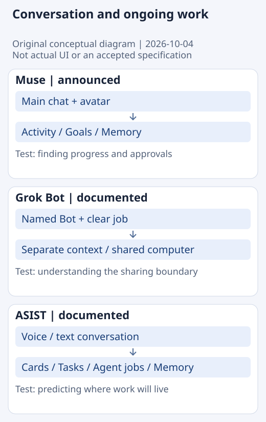
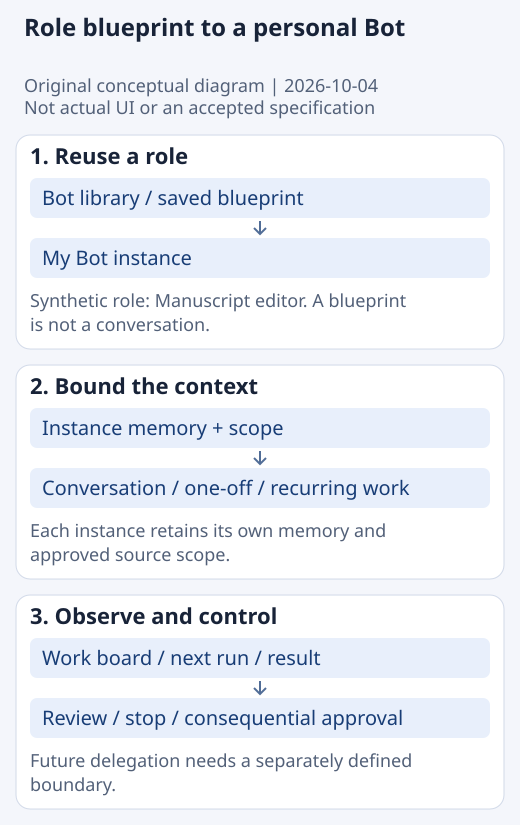

# Competitor comparison

Observed: 2026-10-04 UTC / 2026-10-05 JST. Initial draft. Product notes contain sources and versions. Unconfirmed means unknown, not a defect or lack of support.

## Interaction model

**Original conceptual diagram, not actual product UI.** It abstracts entry points and places for ongoing work described in official material. The diagram covers three products; Dot findings are included in the tables. Instinct awaits product identification.

| Product / evidence | Entry point | Where ongoing work lives |
| --- | --- | --- |
| [Muse](competitors/muse.md) / announced | Main chat and avatar | Activity / Goals and editable Memory [M1] |
| [Grok Bot](competitors/grok-bot.md) / documented | Messages to a named Bot with a clear job | Per-Bot conversation and context; shared computer [G1–G2] |
| [ASIST](competitors/asist.md) / documented + prior hands-on | Voice or text conversation | Cards and purpose-specific mini apps [A1] |
| [Dot](competitors/dot.md) / documented | Conversation with a named assistant and avatar | In progress / Scheduled / Completed [D1–D2] |
| [Instinct](competitors/instinct.md) / unconfirmed | Identity pending | Comparison deferred |

## Capability and scope

| Product | Memory and roles | Background work and approval |
| --- | --- | --- |
| Dot [D1–D2] | Persistent context; individual dot memories cannot be directly edited | Cloud work, recurring checks, delegation and Auto-review |
| Muse [M1] | Personalization and persistent Memory | Scheduled/event work; consequential actions require approval |
| Grok Bot [G1–G2] | Separate roles and conversations; shared resources | Continues in the cloud; role descriptions can define approval boundaries |
| ASIST [A1] | Local memory; selectable conversation model | Agent jobs handed to a CLI require approval before starting |
| Nest / current README | Per-Companion memory, history and scope | Local fixed intervals; cannot execute while its process is stopped; memory updates require approval |

Competitor descriptions do not establish Nest capabilities. General browsing, external sending, purchases, arbitrary source-file writes and always-on cloud execution are outside Nest's current scope.

## Public UI evidence

Source: [Grok Bot Marketplace](https://x.ai/bot/marketplace). Captured 2026-10-04 at 18:33:47 UTC on an unsigned-in public website. Search, use-case categories and character cards are visible. This is public-site visual evidence, not an installed-app test, a test of Add, or a quality benchmark. It is a limited attributed quotation for commentary; it does not grant permission to reuse characters or assets in a product. See [provenance](assets/README.md).

## Evaluation for Nest — hypotheses, not decisions

| Question to learn from | Why it may matter | Next validation |
| --- | --- | --- |
| Dot: conversation to Scheduled | Recurring requests may fit naturally into everyday conversation | Can users explain the next run, stopping behavior and memory limitations afterward? |
| Muse: conversation to Activity / Goals | May connect what was requested with what is happening now | Can users find results, waiting work and the next scheduled run? |
| Grok Bot: a Bot with a clear job | May make roles and scope easier to reuse | Do users distinguish a preset from an individual instance? |
| ASIST: purpose-oriented setup | May explain what is ready and what still needs preparation | Can users unfamiliar with model setup reach a first useful result? |
| ASIST: Tasks / Agent jobs / Memory | Their distinction felt unclear in the prior observation | Where do users expect the same request to appear? |
| Nest: visible schedules | Routine counts and next-run times are current UX research questions | After a conversation, can users explain one-off versus recurring work, the next run and pause state? |

Use [common journeys](use-cases.md) to test fit for a particular purpose rather than assign one overall rank. More external integrations do not automatically make a product better for that purpose.

## Nest concept under study

**Proposed conceptual diagram, not current UI or an accepted specification.** A Bot library would hold presets and saved blueprints; My Bot would contain instances with separate memory and scope. Other ideas under study include a conversation-first main view, a board for one-off and recurring work, a 2D character and less prominent routine settings. Making low-risk Preview internal must preserve explicit approval for consequential operations and scope validation before execution. Bounded multi-Bot delegation is a future research question.

See the [proposed decision record](../../../decisions/0001-research-before-persona-selection.md). Decisions still needed: the primary user group, the first achievable job, and the minimum information required to understand a schedule.

## Roster, scheduling and delegation

| Product | Reuse and multiple Bots | Recurring work and delegation |
| --- | --- | --- |
| Dot [D1–D2] | Personalization; an independent Bot library is unconfirmed | Recurring checks and task-agent delegation |
| Muse [M1–M2] | Main conversation and side chats; user-managed roster is unconfirmed | Scheduled/event work and internal subagents |
| Grok Bot [G1, G3–G5] | Roster, duplication, shared templates and Marketplace | Routines, next run and asynchronous peer handoffs |
| ASIST [A1, H1] | Centers on one assistant; Bot library is unconfirmed | CLI Agent jobs; arbitrary user recurring jobs are unconfirmed |
| Nest / current README | Fixed Companions; a custom library is a future concept | Local interval routines; inter-Bot delegation is not implemented |

Delegation and a user-managed organization of multiple Bots are separate dimensions. Dot and Muse both document delegation. A native durable global Kanban in Grok Bot remains unconfirmed; a table or board produced inside a conversation is not evidence of such a feature.

## Execution, models and cost — partial comparison

| Product | Execution location and model | Cost evidence reviewed |
| --- | --- | --- |
| Dot [D1] | Cloud, optional local access, GPT-6 Astra | Eligible plans and deeper-work allowances; BYOK/model picker unconfirmed |
| Muse [M2–M3] | Cloud VM; local inference not established | Subscription conditions; vendor allowances cannot be converted directly |
| Grok Bot [G2, G6–G7] | Shared account cloud computer; current cited docs say no model picker | Paid plans, weekly allowances and overage |
| ASIST [A1] | Local app/storage with chosen API model and CLI jobs | Model provider bills directly; CLI costs need separate accounting |
| Nest / current README | Installed local Ollama; optional Apple text adapter | Hardware and operating conditions matter alongside subscription costs |

This is not a price ranking. Detailed cost comparison remains incomplete. Match region, plan, model and work volume before calling an option cheap, free or unlimited. Product notes retain the open questions.

## Persona implications — unvalidated

Role presets may reduce the difficulty of starting from a blank page, and characters may help recognition and attachment. Reliable outputs must establish the value of repeat use. A work board is a hypothesis about visibility and intervention, not an assumption that users should dispatch every step. Local privacy has tradeoffs with setup and always-on execution. An owner-and-reviewer handoff provides a bounded starting point for multi-Bot research. None of these ideas is an accepted specification.
