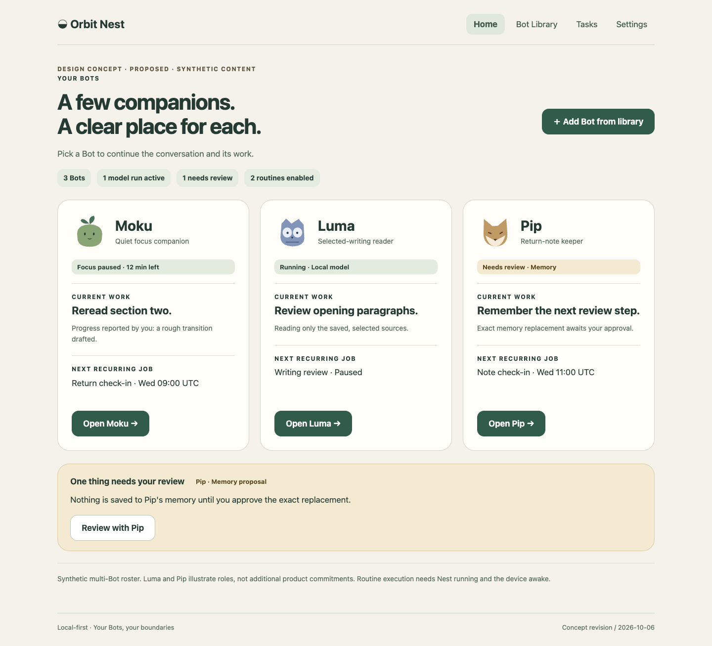
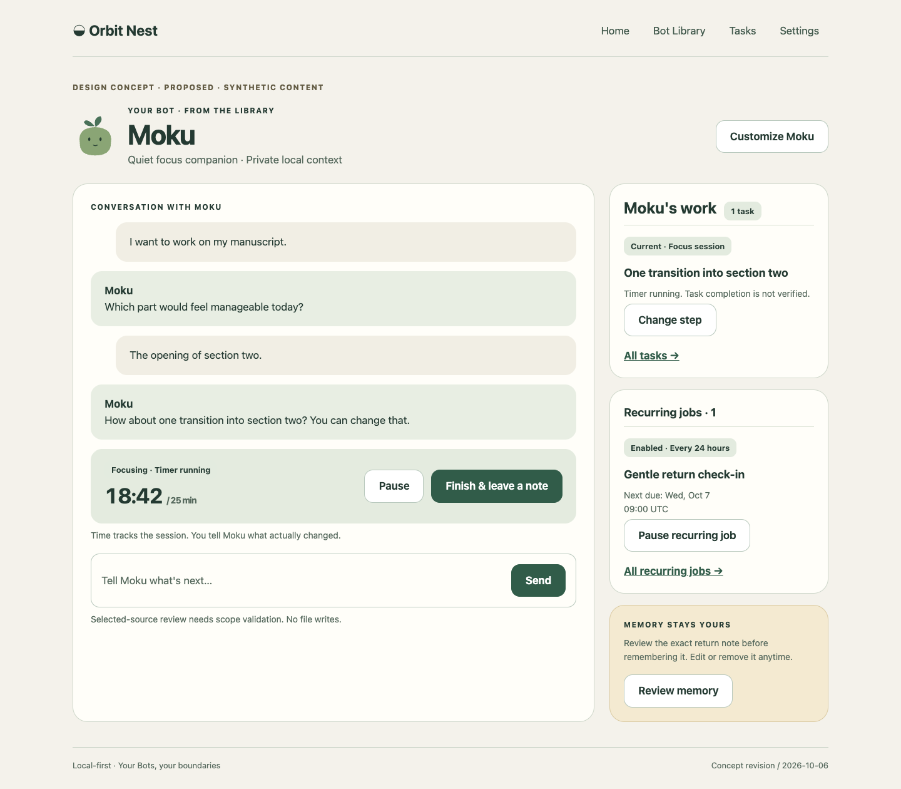
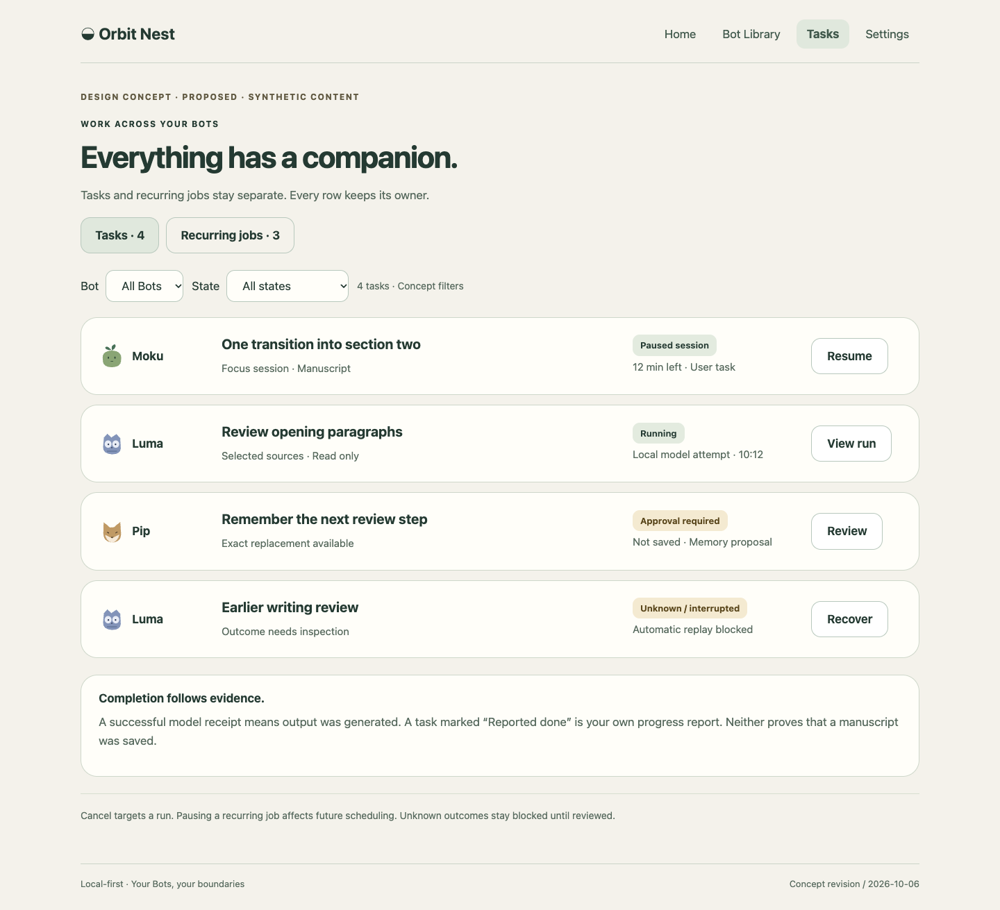
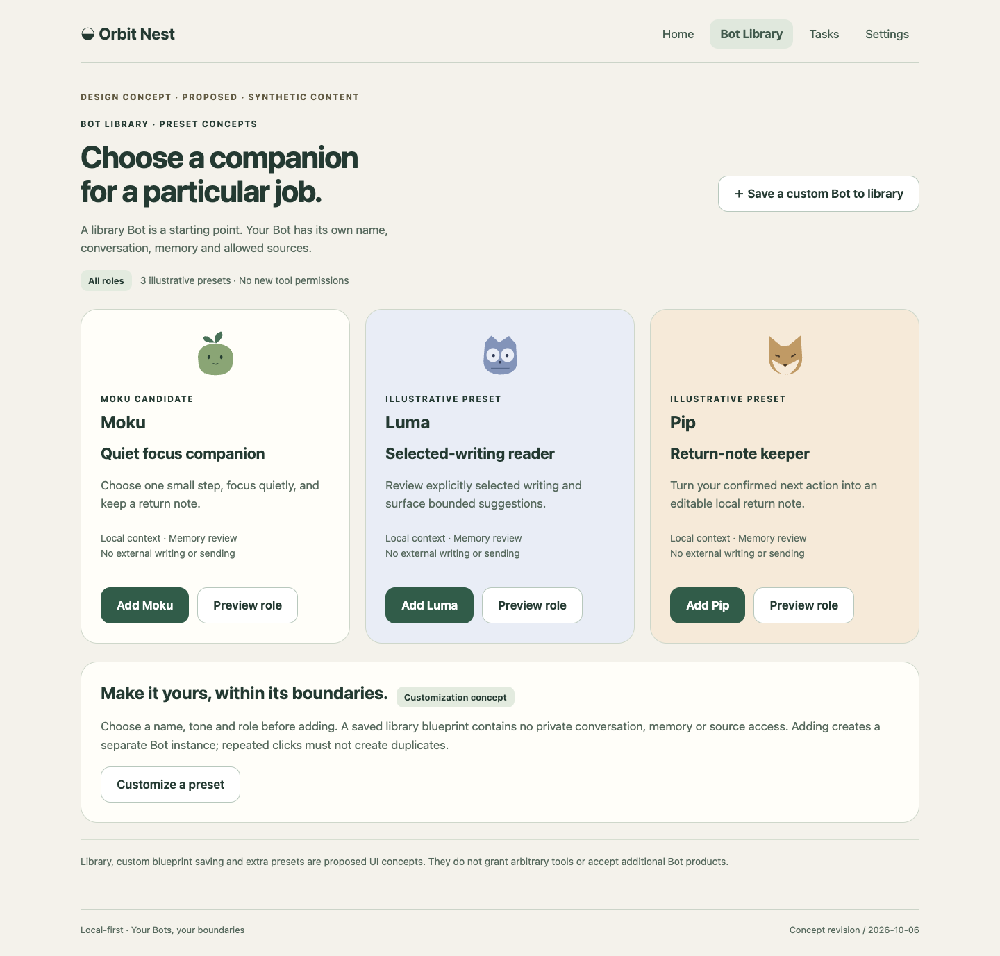
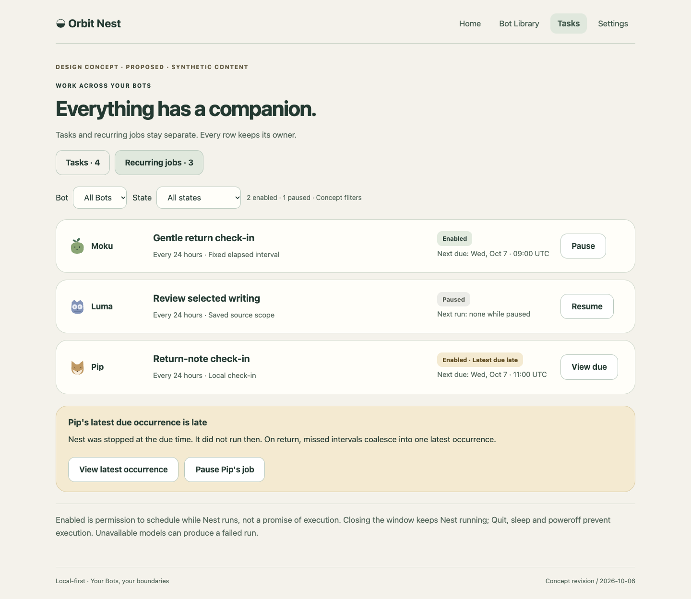

# Moku: a small place to begin again

- Status: Design proposal; not implemented or accepted
- Original start and research period: 2026-10-06 UTC
- Method: design synthesis from repository behavior and prior research; synthetic dialogue and original screen concepts. No user study completed.

## Question and scope

Could a quiet 2D companion help a person begin solo writing or development and return after interruption, without making everyday work feel like operating a developer dashboard?

This study proposes a first Bot, Moku, within the continuing Bot-library and customization direction. It covers persona, relationship, daily journey, task visibility and recovery. It authorizes no runtime change, clinical claim, new tool, always-on execution or external write. Approval to prepare designs is not product acceptance. [ADR 0001](../../../decisions/0001-research-before-persona-selection.md) remains PROPOSED; [ADR 0002](../../../decisions/0002-moku-first-life-bot.md) records this candidate for validation.

## Provisional conclusion

Make the active Bot roster the Nest entry point; Moku is one library Bot. Within Moku, make the current small step and conversation the entry point. Conversation can produce a concrete task card; one ordinary local focus start should feel simple. Keep settings in a secondary destination and reveal permission review only when needed. A timer measures elapsed time; it does not prove work, model success or scheduled execution. Preserve real Orbit receipts separately from user-reported progress.

| Existing pattern / repository evidence | Proposed everyday interaction | Validation question |
| --- | --- | --- |
| Preview then Send binds scope in the backend [R1] | One Start focus control for a timer; validate scope internally for allowed local work | Can people start without misunderstanding what will run? |
| Home projects runs and approvals [R1] | Bot cards summarize actual work; owner-labelled lists expose recoverable state | Can people find unfinished work after an interruption? |
| Explicit memory replacement approval [R1] | Review a short, editable next-step note before remembering | Do people understand and control what survives? |
| Fixed intervals, coalesced missed occurrence, process required [R1] | Routine count, next due time, pause and late state | Can people explain what happens after Quit? |

## Deliverables

- [Persona, relationship and bounded jobs](persona.md)
- [Daily journey and recovery dialogue](journey.md)
- [Multi-Bot structure and rationale](structure.md)
- [Screen and interaction specification](screens.md)
- [One-week self-use protocol](validation.md)
- [Asset provenance and rendering instructions](assets/README.md)

## Evidence and limits

[R1] [Repository README](../../../../README.md), reviewed at remote main `9705f38c7ffc972ae4a8652f7829284ca413bc1b` on 2026-10-06. These are documented current constraints, not live-model tests in this study. [R2] [Prior interaction-model synthesis](../2026-10-04-competitor-landscape/comparison.md) and [common journeys](../2026-10-04-competitor-landscape/use-cases.md), used as historical hypotheses with their original evidence grades. No new competitor claims or broad scan.

Unknowns: whether a character improves repeat use; whether writers and developers share the same friction; acceptable reminder frequency; timer behavior across sleep; whether people distinguish user-reported progress from verified file evidence. Initial testing should not generalize one person's experience to a market or a medical population.

## History

2026-10-06, initial revision: Moku-centered Home, conversation/timer and kanban-style Today concepts were drafted. Preserved in Git at `99f7e1554085121ea8be62ff585772aad0136e89`; not accepted.

2026-10-06, multi-Bot revision: clarified product direction places Moku among library Bots. Replaced app-level Moku branding with a Bot roster, added Library selection/customization, placed Bot-owned work in the right sidebar, and replaced task lanes with separate owner-labelled task and recurring-job lists. This is a design-direction revision, not a correction of vendor facts or acceptance of implementation. See [structure rationale](structure.md) and [ADR 0003](../../../decisions/0003-multi-bot-navigation.md).
