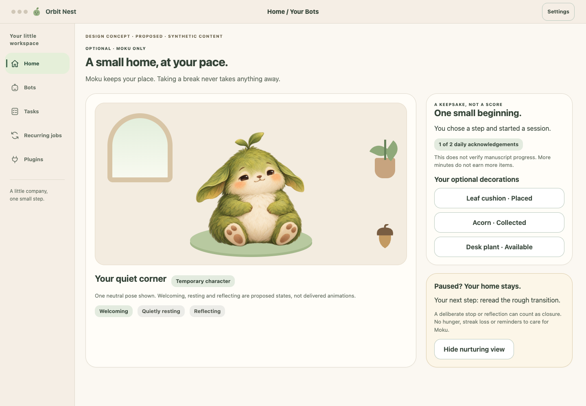

# Moku's quietly growing home — design proposal

2026-10-06 UTC. Original virtual-companion proposal inspired by the general appeal of nurturing a pet, not a licensed Tamagotchi product, artwork or interaction copy. No game or reward system is implemented. This is Moku-specific and optional; other Bots do not inherit a care obligation.

## What grows

Moku remains the same companion. Its small home gains a few optional, durable decorations: a leaf cushion, an acorn keepsake and a tiny desk plant. A short welcoming gesture or expression can acknowledge a beginning or return. No hunger meter, level grind, streak or urgency badge. The first experiment has three expressive states — welcoming, quietly resting and reflecting — and three optional decorations. The current artwork shows one neutral/welcoming pose only; other states are specifications, not delivered animation assets. Clothing, larger rooms and additional unlocks are deferred.

| Moment | Small interaction | Proposed home effect | Truthful meaning |
| --- | --- | --- | --- |
| Choose one step and explicitly start | “One transition is enough for now.” | Eligible for a first daily keepsake | A session was started; work completion is unknown |
| Focus | Moku rests quietly; no requests or popups | No additional reward for elapsed minutes | Timer tracks a session, not manuscript progress |
| Reflect or deliberately stop | “I drafted a rough transition. Next: reread it.” | Eligible for a second daily keepsake; brief reflecting expression | User-reported progress, labelled as such |
| Pause, cancel or take a break | “Let's leave your next step here.” | A deliberate stop with an optional next-step note qualifies like reflection | Healthy closure; no requirement to claim success |
| Return after an interruption or absence | “Welcome back. Your next step is still here.” | Decorations and saved choices stay; no missed-day penalty | No automatic replay or assertion that work finished |

## Bounded reward rule to test

Proposed maximum: two keepsake acknowledgements per local calendar day, at most one for an explicit session start and one for a saved reflection/deliberate-stop event. No reward scales with minutes, attempts, output volume or late-night work. Each unique eligible event grants at most once; start/stop spam after the cap produces no more unlocks or reminders. A calendar day boundary is a cap only: it does not reset possessions or create a streak. The experiment has only three collectible decorations; after they are collected, acknowledgements remain optional and grant no currency. No purchases, ads, scarcity, randomized rarity or spending loop.

Users choose whether to place a decoration; collecting never opens a compulsory customization step. Hide the nurturing view and disable acknowledgements without losing the task workflow. Keep its small status out of task-count and approval badges. During focus, no care prompts, sound, animation or unlock interruption. Breaks and intentional stopping are useful outcomes.

## Persistence and evidence boundaries

Design expectation: preserve Moku's optional enabled state, decoration inventory/placement, bounded reward event IDs and daily counters as private local user state, outside Git. A reward transaction needs an idempotent event key and atomic persistence with its own acknowledgement record. Retry, restart, duplicate clicks and repeated receipt delivery must not grant twice; a crash during commit must yield either one recoverable grant or none, never an invented grant. Clock/timezone changes must not grant a new batch through a backwards date change; exact calendar/cap policy is unresolved and must be designed before implementation. Offline or unavailable model operation does not erase decorations. No background care schedule or daemon is required.

Keep separate evidence fields for user-reported progress, focus-session events and verified agent attempt receipts. Model wording, timer expiry and a keepsake grant cannot mark a real task complete. A successful agent receipt proves its bounded operation/output only, not the user's manuscript completion. Failed, canceled or unknown agent work retains its actual status and approval/recovery requirements; a user can still leave a stop note without rewriting that receipt. Shared execution durability belongs in Orbit; the optional Moku presentation/state must not create a second scheduler.

## Alternatives and one-week experiment

| Alternative | Possible benefit | Risk / unknown |
| --- | --- | --- |
| Three expressions + three optional home items | Visible relationship without much management | May distract or make rewards feel arbitrary |
| Expressions only, no collection | Lowest distraction and state complexity | May not satisfy desire to nurture |
| Personal return-note garden with no rewards | Direct link to actual next steps | Less pet-like; potentially exposes private notes |

Hypothesis, not established efficacy: a calm visible companion may make beginning/returning feel easier. Use the existing [one-week self-use protocol](validation.md) with nurturing enabled on three days and hidden on three days, plus a final preference review. Record start delay from stated intention to explicit start, whether the saved next step was useful on return, time spent customizing, unsolicited pet interactions during focus and a brief distraction/guilt rating. Compare descriptively, not as causal proof. Favor the feature only if it is used voluntarily, does not increase distraction/guilt and participants can explain that a reward does not verify completion. Remove or simplify it if it becomes a chore or motivates empty repeated starts. No scheduled monitoring, medical claims or therapeutic outcome promise.

Unresolved: whether any reward is preferable to expressions alone; suitable daily cap and timezone handling; meaningful non-coercive placement; accessibility of expressive states; whether one-week self-use generalizes; final species/name/art identity. The illustrated Moku is explicitly temporary. [Growing-home visual concept](assets/concepts/08-moku-home.html) and [proposed ADR 0008](../../../decisions/0008-moku-optional-nurturing.md) describe a small test, not acceptance or implementation.

